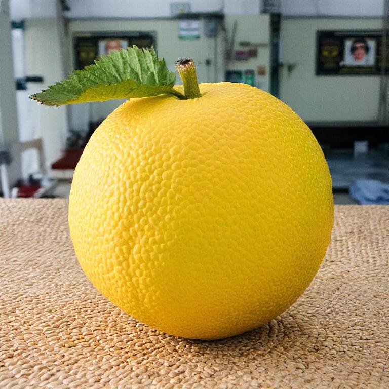
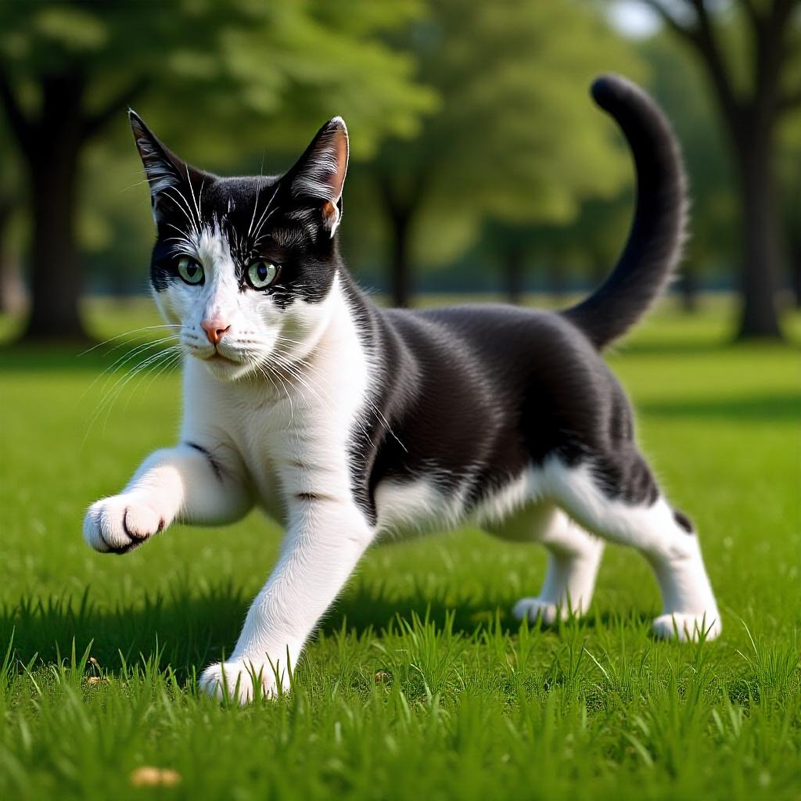

# Scalable Group Inference

**TL;DR:** Treat outputs as a set; formulate group inference as a Quadratic Integer Programming (QIP) problem; scale efficiently with progressive pruning.

[**Website**](https://www.cs.cmu.edu/~group-inference/) | [**Paper**](https://arxiv.org/abs/2508.15773) | [**🤗 Demo FLUX.1 Schnell**](https://huggingface.co/spaces/gparmar/Group-Inference-FLUX.1-Schnell) | [**🤗 Demo FLUX.1 Kontext**](https://huggingface.co/spaces/gparmar/Group-Inference-FLUX.1-Kontext) 


#### **Quick start:** [**Running Locally (CLI)**](#getting-started) | [**Running Locally (Gradio UI)**](#local-gradio-demo) 
<!--HuggingFace Demos: [**Text-to-image**](TODO), [**Depth-to-image**](TODO), [**Canny-to-image**](TODO), [**Image Editing**](TODO), [**Image-to-Video**](TODO)-->

The standard practice is to sample from generative models independently. However, many applications require sampling a model multiple times, for example, to present a gallery of 4-8 outputs. This I.I.D. sampling approach often leads to redundant results, limiting creative exploration.
In this repository, we introduce Scalable Group Inference, a method to generate diverse and high-quality sets of outputs.

<div>
<p align="center">

</p>
</div>


---

## Paper

[Scaling Group Inference for Diverse and High-Quality Generation](https://www.cs.cmu.edu/~group-inference/) <br>
 [Gaurav Parmar](https://gauravparmar.com/), [Or Patashnik](https://orpatashnik.github.io/), [Daniil Ostashev](https://scholar.google.com/citations?user=uD79u6oAAAAJ&hl=en), [Kuan-Chieh (Jackson) Wang](https://wangkua1.github.io/), [Kfir Aberman](https://kfiraberman.github.io/), [Srinivasa Narasimhan](https://www.cs.cmu.edu/~srinivas/), [Jun-Yan Zhu](https://www.cs.cmu.edu/~junyanz/)<br>
arXiv 2508.15773 <br>
CMU and Snap

---

## Method

Given a large number of M candidate noises, we gradually reduce the candidate set through iterative denoising and pruning. At each step, we leverage the diffusion model to denoise the candidates. We then compute a quality metric (unary term) and pairwise distances (binary term), and solve a quadratic integer programming (QIP) problem to progressively prune the set. This ultimately yields a small final group of K diverse and high-quality outputs.

<div>
<p align="center">

</p>
</div>


## Results

**Gallery of outputs.**
Outputs generated with our proposed group inference method and standard I.I.D. sampling. Top row shows results with FLUX.1 Schnell, the second row uses FLUX.1 Dev, and the last two rows use FLUX.1 Depth.
<div>
<p align="center">

</p>
</div>

**Using different score functions**
Our method allows for targeted diversity by defining different pairwise objectives. The
second and third rows show results where the unary quality term is identical but the pairwise binary
term is varied. The middle row uses a color-based binary term, while the bottom row uses a DINObased binary term to achieve semantic and structural diversity.
<div>
<p align="center">

</p>
</div>


## Getting Started
**Environment Setup**
- We provide a [conda env file](environment.yml) that contains all the required dependencies.
    ```
    conda env create -f environment.yaml
    ```
- Following this, you can activate the conda environment with the command below. 
  ```
  conda activate group-inference
  ```

### Text-to-Image group inference
The following command will generate an output of 4 samples for a given prompt with the model `flux-schnell` and `flux-dev`. 
```python
python src/inference.py --prompt "a photo of a dog" --model_name "flux-schnell"
python src/inference.py --prompt "a photo of a playful dog" --model_name "flux-dev"
```
For a complete list of available arguments, see [docs/arguments.md](docs/arguments.md).
  <details open>
  <summary><b>Example Outputs: </b> </summary>
  <table>
    <th>Input Caption</th>
    <th>Output Group Size</th>
    <th>Generated Group</th>
    </tr>
    <tr>
      <td width="200px">A photo of a dog.</td>
      <td width="200px">4</td>
      <td width="350px">
        
        
        
        
      </td>
    </tr>
    <tr>
      <td width="200px">A painting of a dog in the style of van gogh.</td>
      <td width="200px">4</td>
      <td width="350px">
        
        
        
        
      </td>
    </tr>
    </table>
  </details>
  <br>


### Depth-to-Image group inference
The following command will generate an output of 4 samples for a given depth map with the model `flux-depth`.
```python
python src/inference.py --prompt "a photo of a fruit" --model_name "flux-depth" --input_depth_map "assets/example_inputs/depth_fruit.png" 
```
  <details open>
    <summary><b>Example Outputs: </b> </summary>
    <table>
      <th>Input Caption</th>
      <th>Input Depth Map</th>
      <th>Output Group Size</th>
      <th>Generated Group</th>
      </tr>
      <tr>
        <td width="200px">A photo of a fruit.</td>
        <td width="160px">
          
        </td>
        <td width="75px">4</td>
        <td width="350px">
          
          
          
          
        </td>
      </tr>
      </table>
  </details>
  <br>

### Canny Edge-to-Image group inference
The following command will generate an output of 4 samples for a given canny edge map with the FLUX.1 Canny-dev model.
```python
python src/inference.py --prompt "a photo of a robot" --model_name "flux-canny" --input_canny_edge_map "assets/example_inputs/robot_canny.png"
```
  <details open>
    <summary><b>Example Outputs: </b> </summary>
    <table>
      <th>Input Caption</th>
      <th>Input Canny Edge Map</th>
      <th>Output Group Size</th>
      <th>Generated Group</th>
      </tr>
      <tr>
        <td width="200px">A photo of a robot.</td>
        <td width="160px">
          
        </td>
        <td width="75px">4</td>
        <td width="350px">
          
          
          
          
        </td>
      </tr>
      </table>
  </details>
  <br>

### Image editing (FLUX.1 Kontext)
```python
python src/inference.py --prompt "Cat is playing outside in nature." --model_name "flux-kontext" --input_image "assets/example_inputs/cat.png"
```
  <details open>
    <summary><b>Example Outputs: </b> </summary>
    <table>
      <th>Editing Caption</th>
      <th>Input Image</th>
      <th>Output Group Size</th>
      <th>Generated Group</th>
      </tr>
      <tr>
        <td width="200px">Cat is playing outside in nature.</td>
        <td width="160px">
          
        </td>
        <td width="75px">4</td>
        <td width="350px">
          
          
          
          
        </td>
      </tr>
      <tr>
        <td width="200px">Cat is drinking milk.</td>
        <td width="160px">
          
        </td>
        <td width="75px">4</td>
        <td width="350px">
          
          
          
          
        </td>
      </tr>
      </table>
  </details>
  <br>

## Local Gradio Demo
- Install the dependencies for the Gradio demo.
```bash
pip install gradio
```

- Run the Gradio demo with different models:
```bash
# Set the model via environment variable, then run gradio
export MODEL_NAME=flux-schnell && gradio src/gradio_demo.py
export MODEL_NAME=flux-dev && gradio src/gradio_demo.py
export MODEL_NAME=flux-depth && gradio src/gradio_demo.py
export MODEL_NAME=flux-canny && gradio src/gradio_demo.py
export MODEL_NAME=flux-kontext && gradio src/gradio_demo.py
```

---

### Bibtex

If you find this repository useful for your research, please cite the following work.
```
@article{Parmar2025group,
  title={Scaling Group Inference for Diverse and High-Quality Generation},
  author={Gaurav Parmar and Or Patashnik and Daniil Ostashev and Kuan-Chieh (Jackson) Wang and Kfir Aberman and Srinivasa Narasimhan and Jun-Yan Zhu},
  year={2025},
  journal={arXiv preprint arXiv:2508.15773},
}
```


